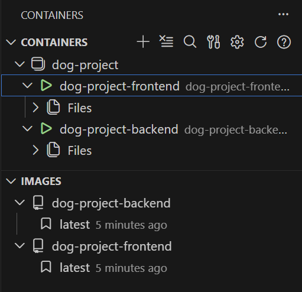
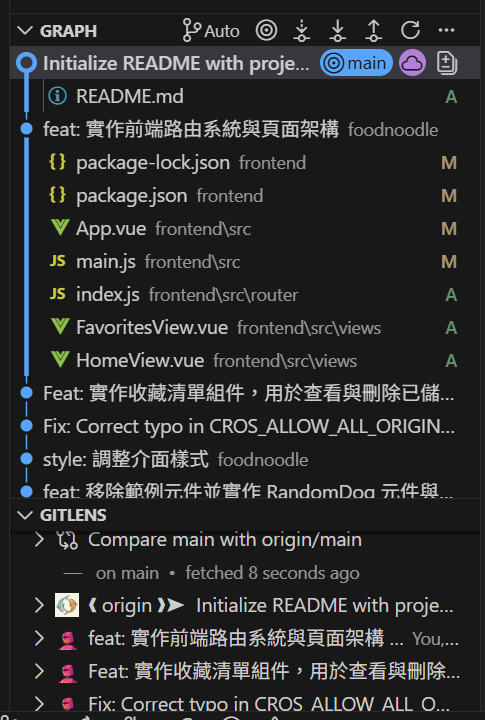
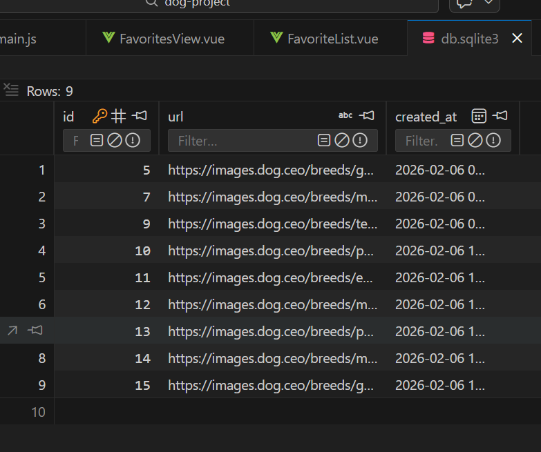

# 狗狗收藏館 (Dog Image Collection) 🐕

這是一個採用前後端分離架構開發的全棧應用程式，使用者可以瀏覽隨機生成的狗狗圖片，並將心儀的圖片收藏至個人資料庫中。

---
## 🚀 技術棧 (Tech Stack)

### 🐍 後端技術 (Backend)

* **執行環境**: **Python 3.14**
* **Web 框架**: **Django 6.0.2**，負責處理後端邏輯與資料庫互動。
* **API 框架**: **Django REST Framework (DRF) 3.16.1**，用於構建 RESTful API 介面，並透過 `ModelViewSet` 與 `DefaultRouter` 實現自動化路由與 CRUD 功能。
* **套件管理**: 使用 **uv** 作為現代化的 Python 套件管理與虛擬環境建置工具。
* **跨網域處理**: 透過 **django-cors-headers** 解決前後端分離產生的 CORS (跨網域資源共享) 問題。
* **資料庫**: 使用 **SQLite3**，用於儲存圖片網址 (URL) 與建立時間戳記。

### ⚡ 前端技術 (Frontend)

* **開發框架**: **Vue 3**，採用 **SFC (Single File Components)** 與 **Composition API (`<script setup>`)** 模式開發。
* **構建工具**: **Vite 7.2.4**，提供極速的開發環境熱重載與優化的生產環境打包。
* **前端路由**: **Vue Router 4.6.4**，管理「首頁」與「收藏頁」之間的視圖切換。
* **HTTP 客戶端**: **Axios 1.13.4**，負責與外部 Dog CEO API 溝通獲取隨機圖片，並與自定義的 Django 後端 API 進行資料同步。

---
## 🐳 Docker 一鍵啟動 (Docker Quick Start)

本專案支援完全自動化的容器化部署。透過 Docker Compose，您可以跳過繁瑣的 Python 與 Node.js 環境設定，實現「一鍵啟動」完整的開發環境。

### 🖼️ 運行狀態預覽
<center>

</center>

> 上圖顯示前後端服務（backend 與 frontend）已成功於 Docker 容器中正常運作。

### 🚀 啟動步驟

1. **確保已安裝 Docker Desktop** 並已啟動。
2. **開啟終端機** 並進入專案根目錄。
3. **執行以下指令**：
```bash
docker-compose up --build
```

### ⚙️ 自動化配置細節

* **自動化資料庫遷移**：後端容器啟動時，會自動執行 `python manage.py migrate` 以確保資料庫結構是最新的，隨後才啟動 Django 伺服器。
* **環境隔離**：
* **Backend**: 使用 Python 3.14 環境，自動安裝 Django 及其相關 API 套件。
* **Frontend**: 使用 Node 20 環境，自動執行 `npm install` 並啟動 Vite 開發伺服器。


* **開發熱重載 (Hot Reload)**：透過磁碟卷（Volumes）掛載技術，您在本地端修改程式碼後，容器內部會即時同步並更新畫面，無需重啟容器。

### 🔗 服務存取位址

* **前端頁面 (Vue)**：`http://localhost:5173`
* **後端 API (DRF)**：`http://localhost:8000/api/`

---
## 🛠️ 開發工具與視覺化

<table width="100%">
  <thead>
    <tr>
      <th width="50%">Git 版本控制 (VS Code Source Control)</th>
      <th width="50%">資料庫視覺化管理 (SQLite Viewer)</th>
    </tr>
  </thead>
  <tbody>
    <tr>
      <td align="center">
        
      </td>
      <td align="center">
        
      </td>
    </tr>
    <tr>
      <td>使用 VS Code 內建的 Source Control 功能進行版本控制，包含檔案變更追蹤、暫存 (stage) 與提交 (commit)。</td>
      <td>透過 SQLite Viewer 開啟資料庫檔案，瀏覽資料表結構與內容，確認資料正確性。</td>
    </tr>
  </tbody>
</table>

---
## 🌟 核心功能

1. **隨機狗狗抽卡 (HomeView)**:


       
* 從外部 Dog CEO API 獲取即時的隨機狗狗圖片。
  

  
* 提供「收藏這張」功能，透過 `POST` 請求將圖片網址傳送至後端儲存。

2. **我的收藏庫 (FavoritesView)**:
   

 
* 展示所有儲存於資料庫中的狗狗圖片，預設依據建立時間進行降冪排列（最新收藏的排在最前）。
* 提供「刪除」功能，可直接從後端資料庫移除指定的收藏項目。


3. **響應式網格佈局**:
* 收藏列表具備響應式設計，能在不同裝置螢幕下自動調整圖片排列順序。

---
## 📂 專案結構

```text
dog-project/
├── backend/        # Django 程式碼
├── frontend/       # Vue 程式碼
├── images/         # 截圖存放區
├── .gitignore
└── README.md
```

* **`backend/`**: 包含 Django 的核心配置 (`config/`) 以及 API 應用程式 (`api/`)，定義了 `DogImage` 模型與序列化邏輯。
* **`frontend/`**: 包含 Vue 應用程式，主要組件位於 `src/components/` (如 `RandomDog.vue`, `FavoriteList.vue`)。

---
## 🔗 API 端點 (Django)

* `GET /api/dogs/`: 獲取收藏清單。
* `POST /api/dogs/`: 新增一張狗狗圖片至收藏。
* `DELETE /api/dogs/{id}/`: 根據 ID 移除收藏。
