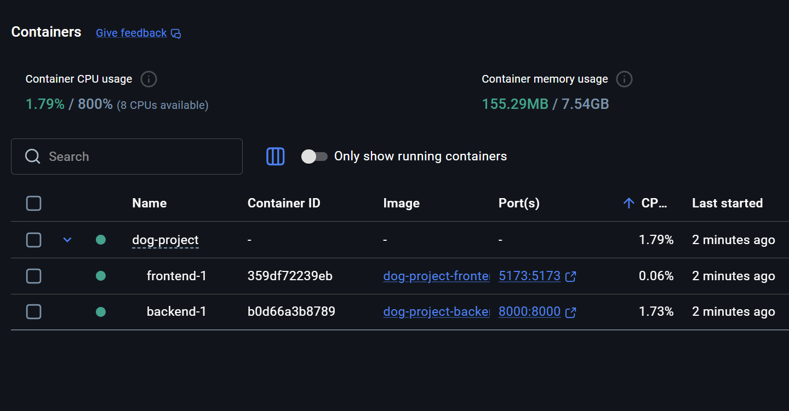
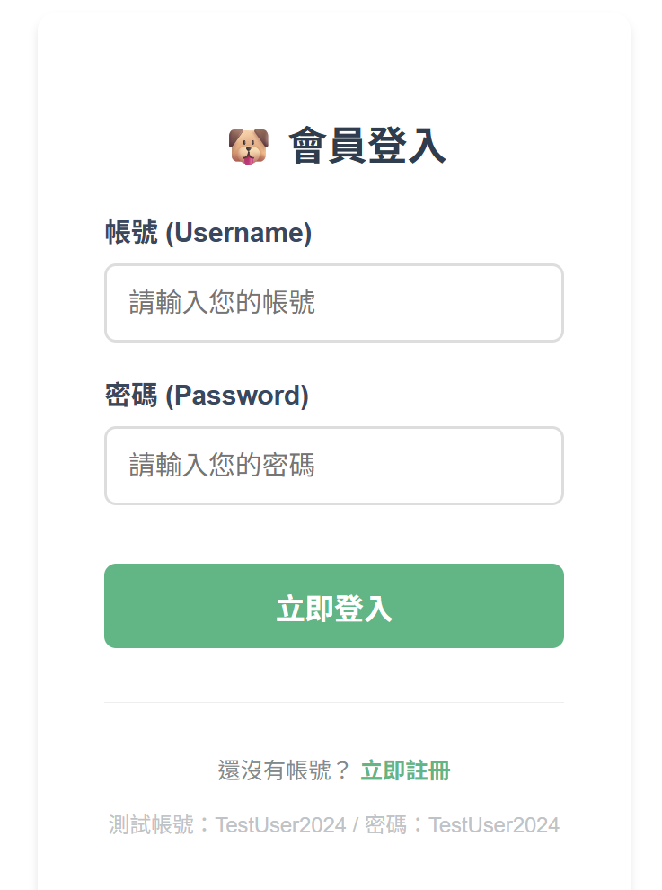
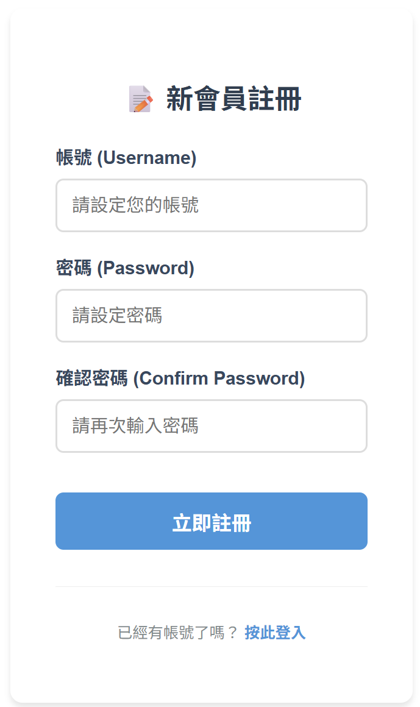
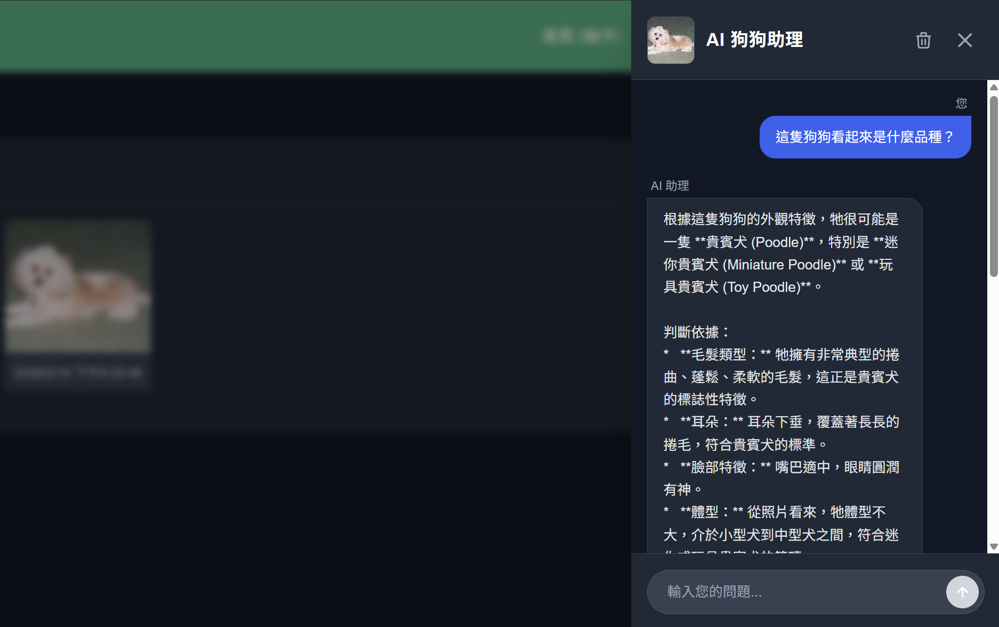

# 狗狗收藏館 (Dog Image Collection) 🐕

<center>


**這是一個採用前後端分離架構開發的全棧應用程式，使用者可以瀏覽隨機生成的狗狗圖片，並將心儀的圖片收藏至個人資料庫中。**

</center>

## 🚀 技術棧 (Tech Stack)


### ⚡ 前端技術 (Frontend)

* **開發框架**: **Vue 3.5.24**，採用 **SFC (Single File Components)** 與 **Composition API (`<script setup>`)** 模式開發。
* **樣式框架**: **Tailwind CSS 3.4.17**，搭配 **PostCSS** 與 **Autoprefixer** 進行現代化 CSS 開發。
* **狀態管理**: **Pinia 3.0.4**，用於全域管理使用者登入狀態 (Auth Store) 與收藏資料。
* **構建工具**: **Vite 7.2.4**，提供極速的開發環境熱重載與優化的生產環境打包。
* **前端路由**: **Vue Router 4.6.4**，管理「首頁」、「收藏頁」、「登入/註冊」之間的視圖切換，並實作導航守衛 (Navigation Guards) 保護私人頁面。
* **HTTP 客戶端**: **Axios 1.13.5**，負責與外部 Dog CEO API 溝通獲取隨機圖片，並與自定義的 Django 後端 API 進行資料同步。

### 🐍 後端技術 (Backend)

* **執行環境**: **Python 3.12**
* **Web 框架**: **Django 6.0.2**，負責處理後端邏輯與資料庫互動。
* **API 框架**: **Django REST Framework (DRF) 3.16.1**，用於構建 RESTful API 介面，並透過 `ModelViewSet` 與 `DefaultRouter` 實現自動化路由與 CRUD 功能。
* **API 文件**: **drf-spectacular 0.29.0**，自動生成符合 OpenAPI 3.0 標準的 API Schema 與 Swagger/Redoc 互動式文件。
* **AI 整合**: **Google GenAI SDK 1.64.0**，整合 Google Gemini 模型以提供智慧對話功能。
* **認證系統**: **dj-rest-auth** 與 **django-allauth**，提供標準化的會員註冊、登入與 Token 驗證機制。
* **套件管理**: 使用 **uv** 作為現代化的 Python 套件管理與虛擬環境建置工具。
* **跨網域處理**: 透過 **django-cors-headers** 解決前後端分離產生的 CORS (跨網域資源共享) 問題。
* **資料庫**: 使用 **SQLite3**，用於儲存圖片網址 (URL) 與建立時間戳記。

---
## 🔐 環境變數設定 (Environment Variables Setup)

在啟動專案之前，請務必設定環境變數。本專案在前端與後端目錄下皆提供了 `.env.example` 範本檔。

請將這些範本檔案複製並重新命名為 `.env`，並根據您的需求（例如 AI API 金鑰等）填入正確的設定值：
* **前端**：複製 `frontend/.env.example` 並重新命名為 `frontend/.env`
* **後端**：複製 `backend/.env.example` 並重新命名為 `backend/.env`

---
## 🐳 Docker 一鍵啟動 (Docker Quick Start)

本專案支援完全自動化的容器化部署。透過 Docker Compose，您可以跳過繁瑣的 Python 與 Node.js 環境設定，實現「一鍵啟動」完整的開發環境。

### 🖼️ 運行狀態預覽

| 終端機運作日誌 (CLI Logs) | Docker Desktop 視覺化管理 |
| :---: | :---: |
|  |  |
| **前後端同步啟動**：顯示 Django 與 Vite 服務已就緒並支援熱重載 | **容器狀態確認**：`backend` 與 `frontend` 服務皆呈現「Running」綠燈狀態 |

> **說明**：本專案透過 Docker Compose 實現環境隔離，確保開發者在任何作業系統上都能獲得一致的執行結果。

### 🚀 啟動步驟

1. **確保已安裝 Docker Desktop** 並已啟動。
2. **開啟終端機** 並進入專案根目錄。
3. **執行以下指令**：
```bash
docker-compose up --build
```

### ⚙️ 自動化配置細節

* **自動化資料庫遷移**：後端容器啟動時，會自動執行 `python manage.py migrate` 以確保資料庫結構是最新的，隨後才啟動 Django 伺服器。
* **環境隔離**：
* **Backend**: 使用 Python 3.12 環境，自動安裝 Django 及其相關 API 套件。
* **Frontend**: 使用 Node 20 環境，自動執行 `npm install` 並啟動 Vite 開發伺服器。


* **開發熱重載 (Hot Reload)**：透過磁碟卷（Volumes）掛載技術，您在本地端修改程式碼後，容器內部會即時同步並更新畫面，無需重啟容器。

### 🔗 服務存取位址

* **前端頁面 (Vue)**：`http://localhost:5173`
* **後端 API (DRF)**：`http://localhost:8000/api/`

---

## 🖥️ 本地開發環境建置 (Local Development Setup)

若您偏好在宿主機直接進行開發而非使用 Docker 容器，請遵循以下配置說明：

### 1. Python 後端環境 (使用 uv)

本專案採用 **uv** 作為現代化的 Python 套件管理工具，以確保依賴項的高速安裝與版本一致性。

* **安裝 uv**：
* **Windows (PowerShell)**:
```powershell
powershell -ExecutionPolicy ByPass -c "irm https://astral.sh/uv/install.ps1 | iex"
```

* **macOS / Linux**:
```bash
curl -LsSf https://astral.sh/uv/install.sh | sh
```

* **同步虛擬環境**：
進入後端目錄並執行同步指令，此動作會自動建立 `.venv` 並安裝所有必要套件：
```bash
cd backend
uv sync
```

* **VS Code 解譯器選取 (Interpreter Selection)**：
1. 於 VS Code 按下 `Ctrl + Shift + P` (或 `Cmd + Shift + P`) 開啟指令面板。
2. 輸入並選取 **`Python: Select Interpreter`**。
3. 手動指向專案內的虛擬環境路徑：
* **Windows**: `./backend/.venv/Scripts/python.exe`
* **macOS / Linux**: `./backend/.venv/bin/python`

### 2. Vue 前端環境 (使用 npm)

前端開發依賴於 Node.js 環境，請確保您的系統已安裝相應版本。

* **安裝相依套件**：
進入前端目錄並執行安裝指令：
```bash
cd frontend
npm install
```

* **啟動開發伺服器**：
執行以下指令開啟具備熱重載功能的 Vite 服務：
```bash
npm run dev
```

---
## 🛠️ 開發工具與視覺化

<table width="100%">
  <thead>
    <tr>
      <th width="50%" align="center">Git 版本控制 (VS Code Source Control)</th>
      <th width="50%" align="center">資料庫視覺化管理 (SQLite Viewer)</th>
    </tr>
  </thead>
  <tbody>
    <tr>
      <td align="center">
        
      </td>
      <td align="center">
        
      </td>
    </tr>
    <tr>
      <td align="center">使用 VS Code 內建的 Source Control 功能進行版本控制，包含檔案變更追蹤、暫存 (stage) 與提交 (commit)。</td>
      <td align="center">透過 SQLite Viewer 開啟資料庫檔案，瀏覽資料表結構與內容，確認資料正確性。</td>
    </tr>
  </tbody>
</table>

---
## 🌟 核心功能

### 1. **會員認證系統 (Authentication)**:
* **註冊/登入 (Sign Up / Login)**: 使用者需註冊帳號並登入後，才能使用收藏功能。
* **JWT 驗證**: 採用 JSON Web Token 機制保護 API，確保資料安全性。

<table width="100%">
  <thead>
    <tr>
      <th width="50%" align="center">登入畫面 (Login)</th>
      <th width="50%" align="center">註冊畫面 (Register)</th>
    </tr>
  </thead>
  <tbody>
    <tr>
      <td align="center">
        
      </td>
      <td align="center">
        
      </td>
    </tr>
  </tbody>
</table>

### 2. **隨機狗狗抽卡 (HomeView)**:


* 從外部 Dog CEO API 獲取即時的隨機狗狗圖片。


  
* 提供「收藏這張」功能，透過 `POST` 請求將圖片網址傳送至後端儲存 **(需登入)**。

### 3. **我的收藏庫 (FavoritesView)**:
   

 
* 展示使用者 **個人專屬** 的收藏列表，預設依據建立時間進行降冪排列。
* 具備 **響應式網格佈局 (Responsive Grid)** 設計，能在不同裝置螢幕下自動調整圖片排列順序。
* 提供「刪除」功能，可直接從後端資料庫移除指定的收藏項目。


### 4. **AI 狗狗諮詢 (AI Dog Consultation)**:

<!-- TODO: 替換為您的 AI 狗狗諮詢 GIF -->


* 整合 Google Gemini AI 模型，提供智慧化的狗狗飼養諮詢服務。
* **對話紀錄 (Chat History)**: 自動保存使用者的諮詢歷史，方便隨時回顧。
* **個人資料與設定 (Profile & Settings)**: 允許使用者管理個人資訊與偏好設定。

---
## 📂 專案結構

```text
dog-project/
├── backend/            # Django 後端程式碼 (Python 3.12 + DRF)
│   ├── api/            # 核心 API 邏輯 (Models, Views, Serializers)
│   ├── chat/           # AI 聊天功能 (Views, URLs)
│   ├── config/         # 專案全域設定
│   ├── pyproject.toml  # uv 套件管理配置
│   ├── uv.lock         # uv 鎖定檔
│   ├── manage.py       # Django 管理指令
│   ├── check_models.py # 模型檢查工具
│   └── Dockerfile      # 後端容器定義
├── frontend/           # Vue 3 前端程式碼 (Vite 構建)
│   ├── src/            # 前端源碼 (Components, Views, Router)
│   ├── public/         # 靜態資源
│   ├── index.html      # Vue 入口 HTML
│   ├── vite.config.js  # Vite 設定檔
│   ├── tailwind.config.js # Tailwind CSS 設定檔
│   ├── postcss.config.js  # PostCSS 設定檔
│   ├── package.json    # 前端相依性與指令配置
│   └── Dockerfile      # 前端容器定義
├── images/             # 專案與教學文件的圖片存儲
│   ├── Readme_images/  # README 專用截圖
│   └── Notes_images/   # 教學筆記專用圖片
├── 筆記/               # 完整的開發教學文件與 Docker 手冊
├── .github/            # GitHub Actions CI/CD 配置
├── .gitignore          # Git 忽略清單
├── docker-compose.yaml # Docker 一鍵啟動配置 (前後端編排)
└── README.md           # 專案主要說明文件
```

* **`backend/`**: 包含 Django 的核心配置 (`config/`) 以及 API 應用程式 (`api/`)，定義了 `DogImage` 模型與序列化邏輯。
* **`frontend/`**: 包含 Vue 應用程式，主要組件位於 `src/components/` (如 `RandomDog.vue`, `FavoriteList.vue`)。

---
## 🔗 API 端點 (Django) 

### **認證管理 (Auth)**
* `POST /api/auth/registration/`: **註冊**。 建立新使用者帳號。
* `POST /api/auth/login/`: **登入**。 取得 JWT Token。
* `POST /api/auth/logout/`: **登出**。 清除 Session。
* `GET /api/auth/user/`: **使用者資訊**。 取得當前登入者資料。

### **收藏管理 (Dogs)**
* `GET /api/dogs/`: **取得圖片收藏列表**。 回傳所有已收藏的圖片，並依建立時間降冪排序。
* `POST /api/dogs/`: **收藏新的圖片**。 將新的狗狗圖片網址 (URL) 儲存至資料庫。
* `GET /api/dogs/{id}/`: **查看單筆圖片資訊**。 根據特定 ID 取得收藏細節。
* `PUT /api/dogs/{id}/`: **修改圖片資訊 (完整)**。 更新特定收藏的完整內容。
* `PATCH /api/dogs/{id}/`: **修改圖片資訊 (部分)**。 更新特定收藏的部分欄位。
* `DELETE /api/dogs/{id}/`: **移除收藏**。 將指定圖片從資料庫中永久刪除。

### **AI 聊天功能 (Chat)**
* `POST /api/chat/ask/`: **發送對話**。 接收使用者輸入並透過 Google Gemini 模型產生回應。


### **API 互動式文件 (OpenAPI)**

下圖是 Swagger UI 的截圖：


* `GET /api/schema/swagger-ui/`: **Swagger UI**。 提供圖形化介面供開發者測試 API。
* `GET /api/schema/redoc/`: **Redoc UI**。 以另一種閱讀友好的格式呈現 API 文件。
* `GET /api/schema/`: **OpenAPI Schema**。 獲取 YAML 格式的原始定義檔。
