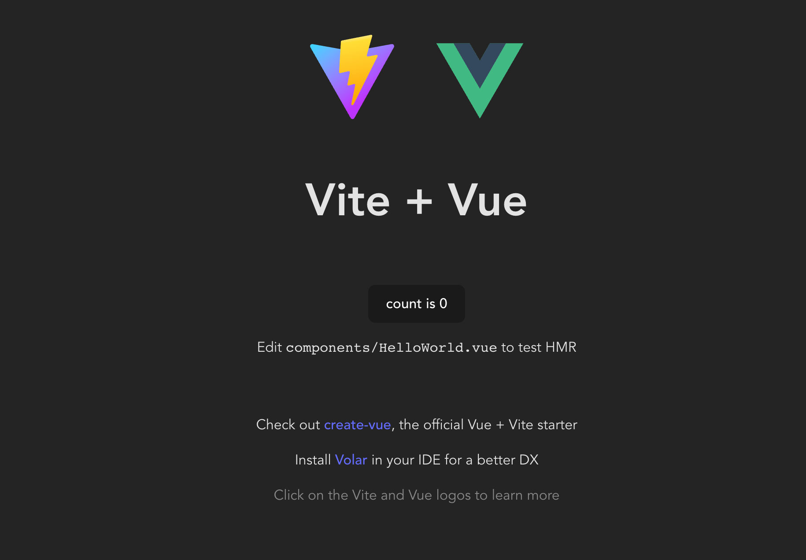

# 從無到有：全棧專案開發實戰全攻略


本教程將指導開發者使用 **Django 後端 + Vue 前端 + 原生 CSS** 的技術棧來開發一個全棧應用程式。若開發環境中尚未安裝 Node.js，必須先完成環境建置，因為現代化的 Vue 開發工具（Vite）依賴於 Node.js 運作。

本教程遵循逐步驗證的原則，每個階段完成後應進行相應的環境驗證。

---

### 第一階段：環境建置與專案初始化

本階段應執行以下三個步驟，以完成開發環境的初始化。

#### 1. 安裝 Node.js

Vue 專案的開發需要 Node.js 環境支援。


* 應從 [Node.js 官網](https://nodejs.org/) 下載 **LTS (Long Term Support)** 版本（建議版本為 v20 或 v22）。
* 下載完成後執行安裝檔，按照預設設定完成安裝。

#### 2. 建立專案根目錄

應在合適的開發位置（例如桌面或 `D:\Projects`）建立專案主目錄。

* 目錄名稱：`dog-project`
* 使用 VS Code 開啟此目錄。

#### 3. 驗證所有工具

在 VS Code 中開啟終端機 (Terminal)（快捷鍵 `Ctrl + ``），依序輸入以下指令並檢查版本號輸出，以確認各工具安裝成功：
```bash
# 1. 檢查 Node.js (新安裝)
node -v

# 2. 檢查 npm (Node 套件管理器，隨 Node 安裝)
npm -v

# 3. 檢查 uv (您原本就有的 Python 工具)
uv --version

# 4. 檢查 git
git --version
```

---

完成以上安裝與驗證後，應確認所有工具版本號正常顯示，方可進入下一階段。

## 第二階段：後端開發環境建置

為了保證專案結構清晰，應將後端程式碼獨立於名為 `backend` 的資料夾中，以便清楚區別後續前後端程式碼之間的界限。本專案建議使用 `uv` 來管理 Python 專案與依賴。

應在 VS Code 終端機（確認目前路徑為 `dog-project`）依序執行以下步驟：

### 初始化 (Django + uv)

#### 1. 建立後端資料夾並初始化

我們建立一個子資料夾 `backend`，並使用 `uv` 初始化一個 Python 專案。
```bash
mkdir backend
cd backend
uv init
```

*(執行後，`backend` 資料夾內會出現 `pyproject.toml` 檔案)*

#### 2. 安裝 Django 與相關套件

使用 `uv add` 安裝我們需要的套件：

* `django`: 後端框架
* `djangorestframework`: 建立 API 用
* `django-cors-headers`: 處理跨域請求 (讓 Vue 能連上 Django)
```bash
uv add django djangorestframework django-cors-headers
```

#### 3. 建立 Django 專案結構

我們使用 `config` 作為專案設定檔的名稱，並注意指令最後有一個 `.` (點)，代表在當前目錄建立。
```bash
uv run django-admin startproject config .
```

#### 4. 建立 API 應用程式 (App)

建立一個名為 `api` 的 App，用來處理狗狗圖片的邏輯。
```bash
uv run python manage.py startapp api
```

---

**執行完畢後，您的 `backend` 資料夾結構應該會長得像這樣：**
```text
backend/
├── .venv/ (隱藏資料夾，uv 自動建立的)
├── api/   (剛剛建立的 App)
├── config/ (Django 設定檔)
├── manage.py
├── pyproject.toml
├── uv.lock
└── ...
```

完成上述指令執行後，應確認無錯誤訊息，方可進入下一階段。

## 第三階段：資料庫模型與專案設定

本階段需要告知 Django 已安裝之套件，並定義資料庫架構（Schema），最後實際建立資料庫檔案。

應依序修改以下檔案與執行指令：

#### 1. 修改設定檔 (`backend/config/settings.py`)

應註冊已安裝的 App，並設定 CORS（跨域請求）。應打開 `backend/config/settings.py` 檔案，找到對應區塊進行修改：

**(1) 在 `INSTALLED_APPS` 清單末尾加入以下三行：**
```python
INSTALLED_APPS = [
    # ... 原有的 Django apps (admin, auth, contenttypes...) 保持不變
    'django.contrib.staticfiles', # 確保此行前面有其他內容
    
    # 新增以下三行：
    'rest_framework',  # 用於建立 API
    'corsheaders',     # 用於處理跨域請求
    'api',             # 自訂應用程式
]
```

**(2) 在 `MIDDLEWARE` 清單最上方加入 corsheaders 中間件：**
*(注意：位置很重要，應放在最上方)*
```python
MIDDLEWARE = [
    'corsheaders.middleware.CorsMiddleware', # 新增此行，放在最上方
    'django.middleware.security.SecurityMiddleware',
    # ... 其他原有的 middleware
]
```

**(3) 在檔案末尾加入 CORS 允許設定：**
*(此設定允許來自任何來源的請求，適用於開發階段)*
```python
# 允許所有來源 (開發階段方便使用)
CORS_ALLOW_ALL_ORIGINS = True
```

---

#### 2. 定義資料模型 (`backend/api/models.py`)

應定義一個資料表以存儲狗狗圖片資訊。應打開 `backend/api/models.py` 檔案，將內容完全替換為以下程式碼：
```python
from django.db import models

class DogImage(models.Model):
    # 儲存圖片的網址
    url = models.URLField(max_length=500)
    # 收藏的時間，自動設為當前時間
    created_at = models.DateTimeField(auto_now_add=True)

    def __str__(self):
        return f"Dog Image {self.id}"
```

---

#### 3. 建立資料庫 (Migrations)

配置模型後，應讓 Django 在資料庫中建立對應的資料表。應在終端機（確保路徑位於 `backend` 資料夾）執行以下指令：
```bash
# 1. 產生遷移檔 (偵測 models.py 的變更)
uv run python manage.py makemigrations

# 2. 執行遷移 (實際寫入資料庫)
uv run python manage.py migrate
```

執行完畢後，應顯示一系列 `OK` 訊息，代表資料庫建立成功。

---

完成上述三個步驟（設定、模型、遷移）後，應驗證資料庫是否正確建立，方可進入下一階段以撰寫 API 的邏輯。

## 第四階段：API 邏輯與路由

資料庫已準備就緒，本階段應建立「對外窗口」，即 API 層。本階段完成後，後端將具備「接收圖片網址並存檔」以及「回傳已收藏圖片」的功能。

應依序新增或修改以下檔案：

#### 1. 建立序列化器 (`backend/api/serializers.py`)

Django 模型物件無法直接轉換為 JSON 格式傳輸，因此需要序列化器作為轉換工具。應在 `backend/api/` 資料夾中新增檔案 `serializers.py`，並貼上以下內容：
```python
from rest_framework import serializers
from .models import DogImage

class DogImageSerializer(serializers.ModelSerializer):
    class Meta:
        model = DogImage
        fields = '__all__'  # 轉換所有欄位 (id, url, created_at)
```

#### 2. 撰寫視圖邏輯 (`backend/api/views.py`)

應定義 API 接收請求後的處理邏輯。本實作使用 DRF 的 `ModelViewSet`，其提供「查詢、新增、刪除」等基本功能。應打開 `backend/api/views.py` 檔案，將內容完全替換為：
```python
from rest_framework import viewsets
from .models import DogImage
from .serializers import DogImageSerializer

class DogImageViewSet(viewsets.ModelViewSet):
    queryset = DogImage.objects.all().order_by('-created_at') # 依照時間倒序排列，新的在上面
    serializer_class = DogImageSerializer
```

#### 3. 設定 App 路由 (`backend/api/urls.py`)

應為 ViewSet 設定 Web 路由。應在 `backend/api/` 資料夾中新增檔案 `urls.py`，並貼上以下內容：
```python
from django.urls import path, include
from rest_framework.routers import DefaultRouter
from .views import DogImageViewSet

# 建立路由器
router = DefaultRouter()
# 註冊我們的 API，路徑前綴為 'dogs'
router.register(r'dogs', DogImageViewSet)

urlpatterns = [
    path('', include(router.urls)),
]
```

#### 4. 掛載到主路由 (`backend/config/urls.py`)

最後，應將 `api` 的路由掛載到整個專案的入口。應打開 `backend/config/urls.py` 檔案，修改 `urlpatterns` 部分：

1. 從 `django.urls` 中引入 `include`。
2. 加入 `path('api/', ...)`。

修改後的完整檔案應如下：
```python
from django.contrib import admin
from django.urls import path, include  # 注意這裡要加 include

urlpatterns = [
    path('admin/', admin.site.urls),
    path('api/', include('api.urls')), # 將我們的 api app 掛載到 /api/ 下
]
```

---

#### 5. 伺服器啟動與測試

後端程式碼編寫完成，應進行測試驗證。應在終端機執行：
```bash
uv run python manage.py runserver
```

執行後，應開啟瀏覽器並輸入網址：`http://127.0.0.1:8000/api/dogs/`

**驗證標準：**
若瀏覽器顯示由 Django REST Framework 提供的介面，並顯示 `HTTP 200 OK` 且清單為空列表 `[]`（因尚未新增資料），則表示後端 API 運作正常。

完成上述步驟並進行驗證後，方可進入下一階段以開發前端。

---

## 📓 補充說明：DRF 自動產生的介面

### DRF 介面頁面名稱的產生

頁面標題「Dog Image List」是 DRF 根據程式碼自動產生，而非手動輸入。
- **來源：** `models.py` 檔案中定義的 `class DogImage`。
- **原理：** DRF 將 **駝峰式命名（CamelCase）** 拆解為可讀的詞彙，並根據視圖類型自動附加標籤（如「List」表示列表頁面）。
- **結論：** 此為 DRF 的自動化功能，協助開發者快速識別資源類型。

### 測試介面的使用

DRF 提供的網頁中有 API 測試介面。
- **功能：** 允許直接在瀏覽器中模擬 HTTP 請求（例如 POST 請求）。
- **用途：** 開發者可在此介面中輸入資料，驗證 API 是否正確處理請求。
- **示例：** 貼上狗狗圖片網址並提交，後端將接收此請求並存儲至資料庫。

---

## 第五階段：前端專案初始化 (Vue + Vite)

既然後端已經就緒（請保持那個終端機視窗開啟，不要關閉，讓伺服器繼續運作），我們現在要開啟**另一個新的終端機**來建立前端。

請依照以下步驟操作：

#### 1. 開啟新終端機

在 VS Code 中，點擊上方選單的 `Terminal` -> `New Terminal`（或是點擊終端機面板右上角的 `+` 號）。

* **注意：** 您現在應該有兩個終端機分頁，一個跑著 Django (Backend)，一個是新的。
* 確認新終端機的路徑是在 `dog-project` 根目錄下。

#### 2. 建立 Vue 專案

應使用 Vite 工具快速建立 Vue 專案。應執行以下指令（遇到詢問時按 Enter 採用預設值）：
```bash
npm create vite@latest frontend -- --template vue
```

#### 3. 安裝依賴套件

專案建立後，應進入資料夾並安裝必要的套件（包含 Vue 及 Axios）：
```bash
# 進入前端資料夾
cd frontend

# 安裝基本依賴
npm install

# 安裝 Axios（用於前後端通訊）
npm install axios
```

#### 4. 啟動前端開發伺服器

安裝完成後，我們來啟動它看看。
```bash
npm run dev
```

執行後，終端機應該會顯示一個網址，通常是 `http://localhost:5173/`。
請按住 `Ctrl` 並點擊該網址開啟。

---

**驗證標準：**



若瀏覽器顯示由 Vite + Vue 提供的預設歡迎畫面（通常包含兩個 Logo 及計數器），則表示前端開發環境配置成功，方可清除範本程式碼。

---

## 第六階段：Git 版本控制與遠端備份

本階段建立版本控制系統並建立遠端備份。建議先暫停所有運行中的伺服器（按 `Ctrl + C`）。
#### 1. 設定 Git 使用者身分 (若尚未設定)

應設定 Git 使用者身分。應在終端機執行以下指令（將引號內容替換為個人資訊）：
```bash
git config --global user.name "您的英文名字"
git config --global user.email "您的 Email"
```

#### 2. 建立忽略清單 (.gitignore)


此步驟至關重要。應建立 `.gitignore` 檔案以排除大型依賴檔案及敏感資料。應在專案根目錄 (`dog-project/`) 建立此檔案並貼上以下內容：
```text
# Python / Django
backend/.venv/
backend/__pycache__/
backend/*.pyc
backend/db.sqlite3
.DS_Store

# Node / Vue
frontend/node_modules/
frontend/dist/
frontend/.env
```

#### 3. 提交程式碼到本機 Git

應將目前進度提交至 **本機 Git 倉庫**。
```bash
# 1. 將所有檔案加入暫存區
git add .

# 2. 提交並撰寫訊息
git commit -m "Initial commit: Setup Django backend and Vue frontend"
```

#### 4. 建立 GitHub 遠端倉庫

應在 GitHub 中建立新的遠端倉庫：
1. 開啟瀏覽器並登入 [GitHub](https://github.com/)。
2. 點擊右上角的 **+** 號，選擇 **New repository**。
3. **Repository name** 設定為 `dog-project`。
4. **Privacy** 選擇 **Public**。
5. 取消勾選 "Add a README file" 或 ".gitignore"（本機已存在）。
6. 點擊 **Create repository**。

#### 5. 連接並推送到 GitHub


倉庫建立後，GitHub 將顯示連接指令。應複製 **"…or push an existing repository from the command line"** 區塊中的指令並在終端機執行：
```bash
git remote add origin https://github.com/您的帳號/dog-project.git
git branch -M main
git push -u origin main
```

**注意：** 執行 `git push` 時，若為首次操作，VS Code 可能彈出授權視窗，應點擊 **Authorize** 或 **Sign in with browser**。

---

**驗證標準：**
若終端機顯示 `Branch 'main' set up to track remote branch 'main'` 等訊息，則表示遠端推送成功，專案已備份至 GitHub。

**「第六階段完成」，本階段已完成版本控制規劃。接下來進入 
**第七階段：前端開發 - 核心功能實作**。

本階段應清除 Vue 的預設範本，並建立首個自訂組件「隨機狗狗產生器」。應依序執行以下步驟：

#### 1. 清理預設檔案

Vite 預設提供的部分檔案與樣式不再需要，應首先刪除。

* 應刪除檔案：`frontend/src/components/HelloWorld.vue`。
* 應清空 `frontend/src/style.css` 中的現有內容，保留為空白檔案，以便後續撰寫自訂 CSS 樣式。

#### 2. 建立 RandomDog 組件

應建立首個 Vue 組件，負責從外部 API 抓取資料並顯示狗狗圖片。應在 `frontend/src/components/` 資料夾下建立檔案 `RandomDog.vue`，並貼上以下程式碼：
```html
<script setup>
import { ref, onMounted } from 'vue';
import axios from 'axios';

// 定義變數
const dogImage = ref(''); // 存放狗狗圖片網址

// 定義函式：去 Dog CEO API 抓圖片
const fetchNewDog = async () => {
  try {
    const response = await axios.get('https://dog.ceo/api/breeds/image/random');
    dogImage.value = response.data.message; // API 回傳的格式是 { message: "圖片網址", status: "success" }
  } catch (error) {
    console.error('發生錯誤:', error);
  }
};

// 組件載入時，先抓一張圖
onMounted(() => {
  fetchNewDog();
});
</script>

<template>
  <div class="dog-card">
    <h2>🐶 隨機狗狗</h2>
    
    <div class="image-container">
      
      <p v-else>載入中...</p>
    </div>

    <div class="button-group">
      <button @click="fetchNewDog" class="btn-refresh">換一張</button>
      <button class="btn-save">收藏這張</button> 
    </div>
  </div>
</template>

<style scoped>
/* 手寫 CSS 練習區 */
.dog-card {
  border: 2px solid #ddd;
  padding: 20px;
  border-radius: 12px;
  max-width: 400px;
  margin: 20px auto;
  text-align: center;
  background-color: #fff;
  box-shadow: 0 4px 6px rgba(0,0,0,0.1);
}

.image-container {
  margin: 20px 0;
  min-height: 300px; /* 固定高度避免跳動 */
  display: flex;
  align-items: center;
  justify-content: center;
  background-color: #f9f9f9;
  border-radius: 8px;
  overflow: hidden;
}

img {
  max-width: 100%;
  max-height: 300px;
  object-fit: contain;
}

.button-group {
  display: flex;
  justify-content: center;
  gap: 10px;
}

button {
  padding: 10px 20px;
  border: none;
  border-radius: 6px;
  cursor: pointer;
  font-size: 16px;
  transition: opacity 0.2s;
}

button:hover {
  opacity: 0.8;
}

.btn-refresh {
  background-color: #4CAF50;
  color: white;
}

.btn-save {
  background-color: #ff9800;
  color: white;
}
</style>
```

#### 3. 修改入口組件 (`App.vue`)

應將編寫好的 RandomDog 組件整合至主入口組件。應打開 `frontend/src/App.vue` 並將內容完全替換為：
```html
<script setup>
import RandomDog from './components/RandomDog.vue';
</script>

<template>
  <div class="app-container">
    <h1>我的狗狗收藏館 🐕</h1>
    <RandomDog />
  </div>
</template>

<style>
/* 全域設定 */
body {
  margin: 0;
  font-family: 'Segoe UI', Tahoma, Geneva, Verdana, sans-serif;
  background-color: #f0f2f5;
}

.app-container {
  max-width: 800px;
  margin: 0 auto;
  padding: 20px;
}

h1 {
  text-align: center;
  color: #333;
}
</style>
```

---

完成以上修改後，應在瀏覽器中查看頁面。若開發伺服器已關閉，應在終端機再次執行 `npm run dev`。

**驗證標準：**
應顯示一個卡片，內含一張狗狗圖片。點擊「換一張」按鈕應能更新圖片顯示。

前端已可獨立運作並能成功從外部 API 抓取資料。

## 第八階段：前後端串接 (收藏功能)

本階段應實現前後端通訊，使前端 (Vue) 將使用者收藏的圖片資料傳送至後端 (Django) 並存入資料庫。本階段將透過程式碼實現自動化的資料提交流程。

請依照以下步驟操作：

#### 1. 確認伺服器狀態

應確認 VS Code 中有兩個運行中的終端機：
1. **後端：** Django 伺服器運行於 `http://127.0.0.1:8000/`。
2. **前端：** Vite 開發伺服器運行於 `http://localhost:5173/`。
如後端伺服器未運行，應在相應終端機執行 `uv run python manage.py runserver`。
#### 2. 修改 RandomDog 組件


應為「收藏這張」按鈕新增功能。應打開 `frontend/src/components/RandomDog.vue` 並修改 `<script setup>` 和 `<template>` 部分。

**修改 A：在 `<script setup>` 中新增 `saveDog` 函式**
應將 `<script setup>` 區塊替換為：
```javascript
<script setup>
import { ref, onMounted } from 'vue';
import axios from 'axios';

const dogImage = ref('');

// 1. 抓取隨機圖片
const fetchNewDog = async () => {
  try {
    const response = await axios.get('https://dog.ceo/api/breeds/image/random');
    dogImage.value = response.data.message;
  } catch (error) {
    console.error('抓取圖片失敗:', error);
  }
};

// 2. [新增] 收藏圖片到 Django 後端
const saveDog = async () => {
  if (!dogImage.value) return; // 如果沒圖片就不執行

  try {
    // 發送 POST 請求給我們的 Django API
    const response = await axios.post('http://127.0.0.1:8000/api/dogs/', {
      url: dogImage.value
    });
    
    // 成功提示 (簡單用 alert，之後可以優化)
    alert('收藏成功！');
    console.log('後端回應:', response.data);
    
  } catch (error) {
    console.error('收藏失敗:', error);
    alert('收藏失敗，請檢查後端伺服器是否開啟。');
  }
};

onMounted(() => {
  fetchNewDog();
});
</script>
```

**修改 B：綁定按鈕事件**
應在組件的 `<template>` 中為「收藏這張」按鈕加入事件綁定：
```html
<button class="btn-save">收藏這張</button> 

<button @click="saveDog" class="btn-save">收藏這張</button> 
```

---

#### 3. 測試功能

應執行測試以驗證前後端通訊：
1. 開啟瀏覽器並前往 `http://localhost:5173`。
2. 在顯示狗狗圖片後點擊「收藏這張」按鈕。
3. 應出現提示訊息表示收藏成功。

#### 4. 驗證資料庫

應驗證資料是否正確被寫入資料庫。應開啟另一個瀏覽器分頁，訪問後端 API 列表：`http://127.0.0.1:8000/api/dogs/`

**驗證標準：**
應在此頁面看到剛剛收藏的圖片資料（`url` 和 `id`）。若收藏多張圖片，列表應相應增長。

## 第九階段：製作收藏列表組件

本階段應在前端顯示並管理已收藏的狗狗圖片列表。需要執行兩項操作：

1. **讀取 (Read):** 從後端 API 獲取所有已收藏的圖片列表並顯示。
2. **刪除 (Delete):** 提供刪除不需要的圖片的功能，完成 CRUD 應用的整體實現。

#### 1. 建立 FavoriteList 組件

請在 `frontend/src/components/` 資料夾下，新增一個檔案 `FavoriteList.vue`，並貼上以下程式碼：
```html
<script setup>
import { ref, onMounted } from 'vue';
import axios from 'axios';

const dogs = ref([]); // 存放從後端抓回來的圖片列表

// 1. 獲取收藏列表 (GET)
const fetchFavorites = async () => {
  try {
    const response = await axios.get('http://127.0.0.1:8000/api/dogs/');
    dogs.value = response.data;
  } catch (error) {
    console.error('無法取得列表:', error);
  }
};

// 2. 刪除圖片 (DELETE) - 這是加碼功能
const deleteDog = async (id) => {
  if (!confirm('確定要刪除這張狗狗嗎？')) return;
  
  try {
    // 呼叫後端 API 刪除該 ID 的資料
    await axios.delete(`http://127.0.0.1:8000/api/dogs/${id}/`);
    // 成功後，重新抓取一次列表，更新畫面
    fetchFavorites();
  } catch (error) {
    alert('刪除失敗');
    console.error(error);
  }
};

// 組件載入時執行
onMounted(() => {
  fetchFavorites();
});
</script>

<template>
  <div class="list-container">
    <div class="header">
      <h2>🏆 我的收藏庫</h2>
      <button @click="fetchFavorites" class="btn-refresh">刷新列表</button>
    </div>

    <div v-if="dogs.length === 0" class="empty-state">
      還沒有收藏狗狗喔，快去上面抓幾張！
    </div>

    <div class="grid">
      <div v-for="dog in dogs" :key="dog.id" class="grid-item">
        
        <button @click="deleteDog(dog.id)" class="btn-delete">刪除</button>
      </div>
    </div>
  </div>
</template>

<style scoped>
.list-container {
  margin-top: 40px;
  padding: 20px;
  background: white;
  border-radius: 12px;
  box-shadow: 0 4px 6px rgba(0,0,0,0.1);
}

.header {
  display: flex;
  justify-content: space-between;
  align-items: center;
  margin-bottom: 20px;
  border-bottom: 2px solid #f0f0f0;
  padding-bottom: 10px;
}

.grid {
  display: grid;
  /* RWD 設定：自動填滿，每欄最小 150px */
  grid-template-columns: repeat(auto-fill, minmax(150px, 1fr));
  gap: 15px;
}

.grid-item {
  position: relative;
  border: 1px solid #eee;
  border-radius: 8px;
  overflow: hidden;
  transition: transform 0.2s;
}

.grid-item:hover {
  transform: translateY(-5px);
  box-shadow: 0 5px 15px rgba(0,0,0,0.1);
}

.grid-item img {
  width: 100%;
  height: 150px;
  object-fit: cover;
  display: block;
}

.btn-delete {
  width: 100%;
  padding: 8px;
  background-color: #ff5252;
  color: white;
  border: none;
  cursor: pointer;
  opacity: 0.9;
}

.btn-delete:hover {
  opacity: 1;
  background-color: #d32f2f;
}

.btn-refresh {
  background-color: #2196F3;
  color: white;
  border: none;
  padding: 8px 16px;
  border-radius: 4px;
  cursor: pointer;
}

.empty-state {
  text-align: center;
  color: #888;
  padding: 20px;
}
</style>
```

#### 2. 整合收藏列表組件至主入口

應修改 `frontend/src/App.vue`，將 FavoriteList 組件整合至應用程式：

1. 在 `<script setup>` 中引入 FavoriteList 組件。
2. 在 `<template>` 中使用該組件。

下述為建議的 `App.vue` 內容範例：
```html
<script setup>
import RandomDog from './components/RandomDog.vue';
import FavoriteList from './components/FavoriteList.vue'; // 新增這行
</script>

<template>
  <div class="app-container">
    <h1>我的狗狗收藏館 🐕</h1>
    <RandomDog />
    <FavoriteList /> 
  </div>
</template>

<style>
/* 保持原本的樣式不變 */
body {
  margin: 0;
  font-family: 'Segoe UI', Tahoma, Geneva, Verdana, sans-serif;
  background-color: #f0f2f5;
}

.app-container {
  max-width: 800px;
  margin: 0 auto;
  padding: 20px;
}

h1 {
  text-align: center;
  color: #333;
}
</style>
```

請在開發環境中執行以下測試流程以驗證功能完整性：

1. 開啟瀏覽器並訪問 `http://localhost:5173`。
2. 驗證「我的收藏庫」區塊是否正確顯示。
3. 執行以下操作驗證各項功能：
   - 點擊「換一張」按鈕，再點擊「收藏這張」，確認圖片被成功收藏。
   - 點擊「刷新列表」按鈕，確認新收藏的圖片出現在列表中。
   - 點擊某張圖片的刪除按鈕，確認該圖片從列表中移除。

若上述三項功能（顯示列表、新增圖片、刪除圖片）均運作正常，則表示全棧應用程式的基礎已完成並通過驗收。