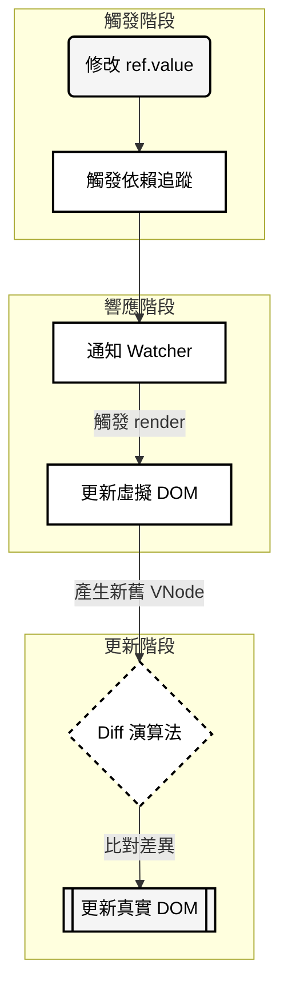
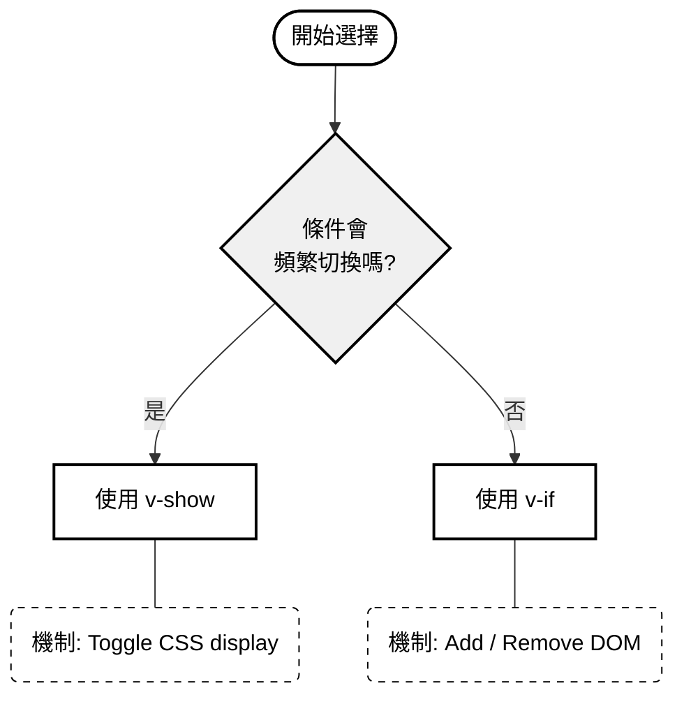
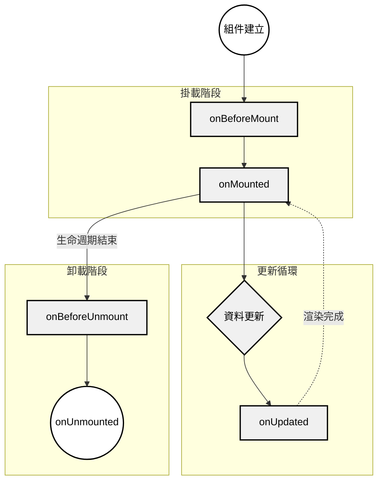
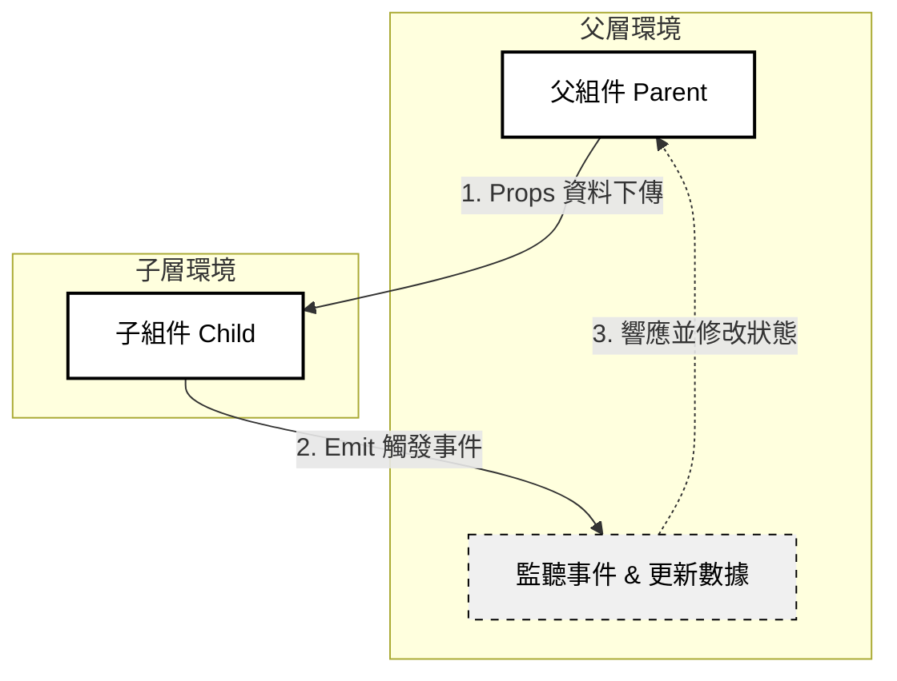

# Vue 3 基礎與組件化

## 第一章：Vue 3 簡介

### Vue 是什麼？
Vue 是一個漸進式 JavaScript 框架，用於構建使用者介面。

**漸進式的含義：**
- 可以只用 Vue 的一小部分（如模版語法）
- 也可以構建完整的單頁應用（SPA）
- 按需增加功能，無需全部或無

### Vue 3 的優勢

| 特性 | 說明 |
|------|------|
| 組件化 | 將 UI 拆分為可重用的組件 |
| 反應性系統 | 資料變化自動更新 DOM |
| 虛擬 DOM | 高效率的 DOM 更新演算法 |
| TypeScript 支持 | 更好的類型檢查 |
| Composition API | 更靈活的邏輯組織方式 |

---

## 第二章：Composition API 與 script setup

### script setup 語法

```vue
<script setup>
import { ref, onMounted } from 'vue'

// 定義響應式資料
const dogImage = ref('')

// 定義函數
const fetchNewDog = async () => {
  // 邏輯代碼
}

// 組件掛載後執行
onMounted(() => {
  fetchNewDog()
})
</script>
```

**優勢：**
- 語法簡潔，無需明確返回資料
- 自動暴露變數給模版
- 更好的類型推導

### ref 函數與響應性

**Vue 響應式更新機制**


```javascript
import { ref } from 'vue'

// 建立響應式變數
const dogImage = ref('')

// 在 JavaScript 中訪問需要 .value
console.log(dogImage.value)

// 在模版中 Vue 自動解包，無需 .value
// <p>{{ dogImage }}</p>
```

**ref 的作用：**
- 使變數具有響應性
- 資料變化時自動觸發 DOM 更新
- 支援所有 JavaScript 類型（基本型別、物件、陣列）

### reactive 與 ref 的區別

```javascript
import { ref, reactive } from 'vue'

// ref：包裹任何值
const count = ref(0)
count.value++

// reactive：只用於物件
const state = reactive({ count: 0 })
state.count++

// 推薦：大多數情況用 ref
```

---

## 第三章：模版語法

### 資料綁定

```vue
<template>
  <!-- 文本插值 -->
  <p>{{ message }}</p>
  
  <!-- 屬性綁定 -->
  
  
  <!-- 簡寫形式 -->
    <!-- 等同於 v-bind:src -->
</template>
```

### 條件渲染

```vue
<template>
  <!-- v-if：條件為真時渲染 -->
  <div v-if="isLoading">載入中...</div>
  
  <!-- v-else-if 和 v-else -->
  <div v-else-if="hasError">載入失敗</div>
  <div v-else>成功載入</div>
  
  <!-- v-show：切換 display 樣式（性能較好） -->
  <div v-show="visible">總是在 DOM 中，只隱藏</div>
</template>
```
**v-if 與 v-show 選擇決策樹**



**v-if vs v-show：**

| 屬性 | v-show | v-if |
|------|------|--------|
| 初始渲染 | 慢（渲染不可見元素） | 快 |
| 切換成本 | 低（只改樣式） | 高（加/移除 DOM） |
| 何時用 | 條件頻繁切換 | 條件不常變化 |

### 列表渲染

```vue
<template>
  <!-- v-for 迴圈 -->
  <div v-for="item in items" :key="item.id">
    {{ item.name }}
  </div>
  
  <!-- 含索引 -->
  <div v-for="(item, index) in items" :key="index">
    {{ index }}: {{ item.name }}
  </div>
  
  <!-- 物件屬性迭代 -->
  <div v-for="(value, key) in obj" :key="key">
    {{ key }}: {{ value }}
  </div>
</template>
```

**:key 的重要性：**
- 幫助 Vue 識別哪些元素已更改
- 提高列表更新的效率
- 避免狀態混亂（如輸入框的值）

---

## 第四章：事件處理

### 事件綁定

```vue
<template>
  <!-- 綁定事件 -->
  <button @click="handleClick">按我</button>
  
  <!-- 帶參數 -->
  <button @click="handleClick('hello')">帶參數</button>
  
  <!-- 訪問事件物件 -->
  <input @input="handleInput($event)" />
</template>

<script setup>
const handleClick = (message) => {
  console.log(message)
}

const handleInput = (event) => {
  console.log(event.target.value)
}
</script>
```

### 常見事件修飾符

| 修飾符 | 說明 |
|--------|------|
| `.prevent` | 阻止預設行為 (`e.preventDefault()`) |
| `.stop` | 停止事件傳播 (`e.stopPropagation()`) |
| `.once` | 事件只觸發一次 |
| `.passive` | 提高滾動效能 |

```vue
<!-- 範例 -->
<form @submit.prevent="handleSubmit">
  <input type="text" />
  <button type="submit">提交</button>
</form>
```

---

## 第五章：計算屬性 (Computed Properties)

### computed 函數

```javascript
import { ref, computed } from 'vue'

const firstName = ref('John')
const lastName = ref('Doe')

// 自動計算，並且有緩存
const fullName = computed(() => {
  return `${firstName.value} ${lastName.value}`
})

console.log(fullName.value)  // "John Doe"
```

**computed vs 方法：**
```javascript
// ✅ 計算屬性：有緩存，效率高
const fullName = computed(() => {
  console.log('計算一次')
  return `${firstName.value} ${lastName.value}`
})

// ❌ 方法：每次都執行
const getFullName = () => {
  console.log('每次都計算')
  return `${firstName.value} ${lastName.value}`
}
```

---

## 第六章：生命週期鉤子 (Lifecycle Hooks)

### Vue 3 組件生命週期



```javascript
import {
  onMounted,
  onUpdated,
  onUnmounted,
  onBeforeMount,
  onBeforeUpdate,
  onBeforeUnmount
} from 'vue'

export default {
  setup() {
    // 組件建立但在掛載前
    onBeforeMount(() => {
      console.log('關鍵：DOM 還不存在')
    })
    
    // 組件掛載到 DOM 後
    onMounted(() => {
      console.log('✅ 常用：可以訪問 DOM 和執行 AJAX')
      fetchData()
    })
    
    // 資料更新時
    onUpdated(() => {
      console.log('資料已更新，DOM 已重繪')
    })
    
    // 組件被移除前
    onBeforeUnmount(() => {
      console.log('準備卸載，清理資源')
    })
    
    // 組件完全移除
    onUnmounted(() => {
      console.log('清空計時器、事件監聽等')
    })
  }
}
```

### 常見使用場景

| 鉤子 | 用途 |
|------|------|
| `onMounted` | 從 API 獲取資料、初始化第三方庫 |
| `onUpdated` | 監聽資料變化後的 DOM 更新 |
| `onUnmounted` | 清理定時器、移除事件監聽 |

---

## 第七章：組件通信

### 父子通信：Props 與 Emits

**Vue 父子組件溝通模式**




**父組件傳遞 Props：**
```vue
<!-- ParentComponent.vue -->
<template>
  <ChildComponent :message="parentMessage" @child-event="handleChildEvent" />
</template>

<script setup>
import { ref } from 'vue'
import ChildComponent from './ChildComponent.vue'

const parentMessage = ref('Hello from parent')

const handleChildEvent = (data) => {
  console.log('Received from child:', data)
}
</script>
```

**子組件接收與發送：**
```vue
<!-- ChildComponent.vue -->
<script setup>
// 接收 Props
defineProps({
  message: String
})

// 定義可發送的事件
const emit = defineEmits(['child-event'])

const sendToParent = () => {
  emit('child-event', 'Data from child')
}
</script>

<template>
  <div>
    <p>{{ message }}</p>
    <button @click="sendToParent">發送給父組件</button>
  </div>
</template>
```

---

## 第八章：樣式綁定

### Class 動態綁定

```vue
<template>
  <!-- 物件語法 -->
  <div :class="{ active: isActive, disabled: !isEnabled }">
    樣式會根據條件改變
  </div>
  
  <!-- 陣列語法 -->
  <div :class="[isActive ? 'active' : '', 'base-class']">
    組合多個類名
  </div>
</template>

<script setup>
import { ref } from 'vue'
const isActive = ref(true)
const isEnabled = ref(false)
</script>
```

### Style 動態綁定

```vue
<template>
  <!-- 物件語法 -->
  <div :style="{ color: activeColor, fontSize: fontSize + 'px' }">
    動態樣式
  </div>
  
  <!-- 多個物件 -->
  <div :style="[baseStyles, conditionalStyles]">
    多樣式物件
  </div>
</template>

<script setup>
import { ref } from 'vue'
const activeColor = ref('red')
const fontSize = ref(14)
</script>
```

---

## 總結

Vue 3 核心概念：
✅ 響應式系統（ref、reactive）
✅ 模版語法與事件處理
✅ 組件化開發
✅ 生命週期管理
✅ 計算屬性與監聽
✅ 優雅的父子通信
