# 專案架構與開發流程

## 第一章：全棧應用架構

### 典型的全棧應用結構

```
客戶端（Frontend）
    ├─ Vue 3 應用
    ├─ UI 組件與視圖
    └─ 業務邏輯
         ⬇️ HTTP 請求（Axios）/回應
伺服器（Backend）
    ├─ Django REST Framework
    ├─ API 端點
    └─ 業務邏輯
         ⬇️ 資料庫操作
資料庫（Database）
    ├─ SQLite / PostgreSQL
    └─ 資料表與索引
```

### 前後端分離的好處

| 優勢 | 說明 |
|------|------|
| 獨立開發 | 前後端團隊並行工作 |
| 易於測試 | API 可單獨測試 |
| 技術靈活 | 前後端技術棧獨立 |
| 可複用 | 同一 API 支援多個客戶端 |
| 部署靈活 | 前後端可分開部署 |

---

## 第二章：專案目錄結構解析

### 後端結構

```
backend/
├── manage.py              # Django 管理腳本
├── pyproject.toml         # 依賴定義
├── config/                # 專案配置
│   ├── settings.py        # 全域設定
│   ├── urls.py            # 主路由
│   ├── wsgi.py            # WSGI 應用
│   └── asgi.py            # ASGI 應用（非同步）
├── api/                   # API 應用
│   ├── models.py          # 資料模型
│   ├── views.py           # 視圖邏輯
│   ├── serializers.py     # 序列化器
│   ├── urls.py            # API 路由
│   ├── tests.py           # 單元測試
│   └── migrations/        # 資料庫遷移
└── db.sqlite3             # SQLite 資料庫
```

**各個檔案的責任：**
- `models.py`：定義資料結構（資料庫表格）
- `views.py`：處理 HTTP 請求的業務邏輯
- `serializers.py`：資料序列化與驗證
- `urls.py`：定義 API 路由映射

### 前端結構

```
frontend/
├── package.json           # 依賴定義
├── vite.config.js         # Vite 構建配置
├── index.html             # HTML 入口
├── public/                # 靜態資源
└── src/
    ├── main.js            # 應用入口
    ├── App.vue            # 根組件
    ├── style.css          # 全域樣式
    ├── router/
    │   └── index.js       # 路由配置
    ├── views/             # 頁面級組件
    │   ├── HomeView.vue
    │   └── FavoritesView.vue
    ├── components/        # 可複用組件
    │   ├── RandomDog.vue
    │   └── FavoriteList.vue
    └── assets/            # 資源檔案
```

**命名約定：**
- `views/` 對應路由，是頁面級組件
- `components/` 是可複用的 UI 組件
- 檔案名用 PascalCase 大駝峰式

---

## 第三章：開發工作流程

### 1. 本地開發環境啟動

**啟動後端服務器：**
```bash
cd backend
python manage.py runserver
# 啟動在 http://127.0.0.1:8000
```

**啟動前端開發伺服器：**
```bash
cd frontend
npm run dev
# 啟動在 http://localhost:5173
```

### 2. 開發一個新功能的完整流程

**步驟 1：定義資料模型（後端）**
```python
# api/models.py
class DogImage(models.Model):
    url = models.URLField(max_length=500)
    created_at = models.DateTimeField(auto_now_add=True)
```

**步驟 2：創建資料庫遷移**
```bash
python manage.py makemigrations
python manage.py migrate
```

**步驟 3：建立序列化器（後端）**
```python
# api/serializers.py
class DogImageSerializer(serializers.ModelSerializer):
    class Meta:
        model = DogImage
        fields = '__all__'
```

**步驟 4：實現 API 視圖（後端）**
```python
# api/views.py
class DogImageViewSet(viewsets.ModelViewSet):
    queryset = DogImage.objects.all().order_by('-created_at')
    serializer_class = DogImageSerializer
```

**步驟 5：註冊路由（後端）**
```python
# api/urls.py
router = DefaultRouter()
router.register(r'dogs', DogImageViewSet)
```

**步驟 6：建立前端組件**
```vue
<!-- components/RandomDog.vue -->
<script setup>
import { ref, onMounted } from 'vue'
import axios from 'axios'

const dogImage = ref('')

const fetchNewDog = async () => {
  const response = await axios.get('https://dog.ceo/api/breeds/image/random')
  dogImage.value = response.data.message
}

onMounted(() => {
  fetchNewDog()
})
</script>
```

**步驟 7：集成 API 調用（前端）**
```javascript
const saveDog = async () => {
  await axios.post('http://127.0.0.1:8000/api/dogs/', {
    url: dogImage.value
  })
  alert('收藏成功！')
}
```

**步驟 8：在路由中使用組件（前端）**
```javascript
// router/index.js
import RandomDog from '../components/RandomDog.vue'
```

---

## 第四章：資料流向

### 用戶收藏狗狗圖片的整個流程

```mermaid
flowchart LR
    %% === 樣式定義 ===
    %% 基礎節點風格 (黑白高對比)
    classDef base fill:#fff,stroke:#333,stroke-width:2px,color:#000;
    classDef action fill:#f9f9f9,stroke:#333,stroke-width:2px,stroke-dasharray: 5 5,color:#000;
    classDef db fill:#eee,stroke:#333,stroke-width:2px,stroke-width:2px,color:#000;
    
    %% Subgraph 背景風格 (淡灰階區分區域)
    style Client fill:#ffffff,stroke:#333,stroke-width:2px,color:#000
    style Server fill:#f4f4f4,stroke:#333,stroke-width:2px,stroke-dasharray: 5 5,color:#000
    style Database fill:#e0e0e0,stroke:#333,stroke-width:2px,color:#000

    %% === 流程定義 ===
    subgraph Client [前端 : RandomDog.vue]
        direction TB
        Click(("👆 點擊按鈕<br>@click='saveDog'"))
        Success["✅ 收藏成功<br>alert() / Update UI"]
    end

    subgraph Server [後端處理 API]
        direction TB
        Req>"POST /api/dogs/<br>{ 'url': '...' }" ]
        Logic["ViewSet.create()"]
        Check{"Serializer<br>資料驗證"}
        Res>"201 Created<br>{ id: 1, ... }" ]
    end

    subgraph Database [SQLite 資料庫]
        SQL[("💾 INSERT INTO<br>api_dogimage")]
    end

    %% === 連線邏輯 ===
    Click --> Req
    Req --> Logic
    Logic --> Check
    
    %% 驗證成功路徑
    Check -->|Pass| SQL
    SQL -->|Saved| Res
    
    %% 回傳路徑
    Res --> Success

    %% === 套用樣式 ===
    class Click,Logic,Check base;
    class Req,Res action;
    class SQL db;
    class Success base;
```


---

## 第五章：測試最佳實踐

### 後端 API 測試

**使用 Postman 或 curl 測試：**
```bash
# 取得所有狗狗
curl http://127.0.0.1:8000/api/dogs/

# 建立新狗狗
curl -X POST http://127.0.0.1:8000/api/dogs/ \
  -H "Content-Type: application/json" \
  -d '{"url":"https://example.com/dog.jpg"}'

# 刪除狗狗
curl -X DELETE http://127.0.0.1:8000/api/dogs/1/
```

**Django 單元測試：**
```python
# api/tests.py
from django.test import TestCase
from rest_framework.test import APIClient
from .models import DogImage

class DogImageTestCase(TestCase):
    def setUp(self):
        self.client = APIClient()
    
    def test_list_dogs(self):
        response = self.client.get('/api/dogs/')
        self.assertEqual(response.status_code, 200)
    
    def test_create_dog(self):
        response = self.client.post('/api/dogs/', {
            'url': 'https://example.com/dog.jpg'
        })
        self.assertEqual(response.status_code, 201)
```

**執行測試：**
```bash
python manage.py test
```

### 前端組件測試

```javascript
// components/__tests__/RandomDog.spec.js
import { describe, it, expect, vi } from 'vitest'
import { mount } from '@vue/test-utils'
import RandomDog from '../RandomDog.vue'
import axios from 'axios'

vi.mock('axios')

describe('RandomDog Component', () => {
  it('顯示加載中狀態', async () => {
    const wrapper = mount(RandomDog)
    expect(wrapper.text()).toContain('載入中...')
  })
  
  it('收藏按鈕觸發 POST 請求', async () => {
    axios.post.mockResolvedValue({ data: { id: 1 } })
    const wrapper = mount(RandomDog)
    await wrapper.find('button.btn-save').trigger('click')
    expect(axios.post).toHaveBeenCalled()
  })
})
```

---

## 第六章：常見開發問題與解決方案

### CORS 錯誤

**症狀：** 前端請求被瀏覽器阻止
```
Access to XMLHttpRequest at 'http://127.0.0.1:8000/api/dogs/' 
from origin 'http://localhost:5173' has been blocked by CORS policy
```

**解決：**
```python
# settings.py
INSTALLED_APPS = ['corsheaders', ...]
MIDDLEWARE = ['corsheaders.middleware.CorsMiddleware', ...]
CORS_ALLOWED_ORIGINS = ['http://localhost:5173']
```

### 404 資源未找到

**可能原因：**
1. API URL 拼寫錯誤
2. 後端伺服器未啟動
3. URL 路由未正確註冊

**調試步驟：**
```bash
# 檢查路由
python manage.py show_urls

# 用 curl 測試
curl http://127.0.0.1:8000/api/dogs/
```

### 資料驗證失敗（400 Bad Request）

**檢查回應詳情：**
```javascript
try {
  await axios.post('/dogs/', data)
} catch (error) {
  console.log('錯誤詳情:', error.response.data)
  // 通常會返回欄位的具體驗證錯誤
}
```

---

## 第七章：部署清單

### 生產環境前的檢查清單

```
後端準備：
☐ 關閉 DEBUG 模式 (settings.py: DEBUG = False)
☐ 設定 ALLOWED_HOSTS
☐ 設定強大的 SECRET_KEY
☐ 配置資料庫（不用 SQLite）
☐ 設定靜態檔案收集
☐ 配置郵件設定
☐ 執行單元測試

前端準備：
☐ 執行 npm run build
☐ 測試構建版本
☐ 檢查 API 基礎 URL 配置
☐ 檢查資源載入路徑

CORS 配置：
☐ 更新 CORS_ALLOWED_ORIGINS 為生產域名
☐ 移除開發環境的寬鬆設定
```

---

## 總結

全棧開發要點：
✅ 理解前後端分離架構
✅ 清晰的目錄結構和責任分工
✅ 完整的開發工作流程
✅ 良好的資料流向設計
✅ 充分的測試覆蓋
✅ 正確處理常見問題
✅ 為生產環境做好準備
